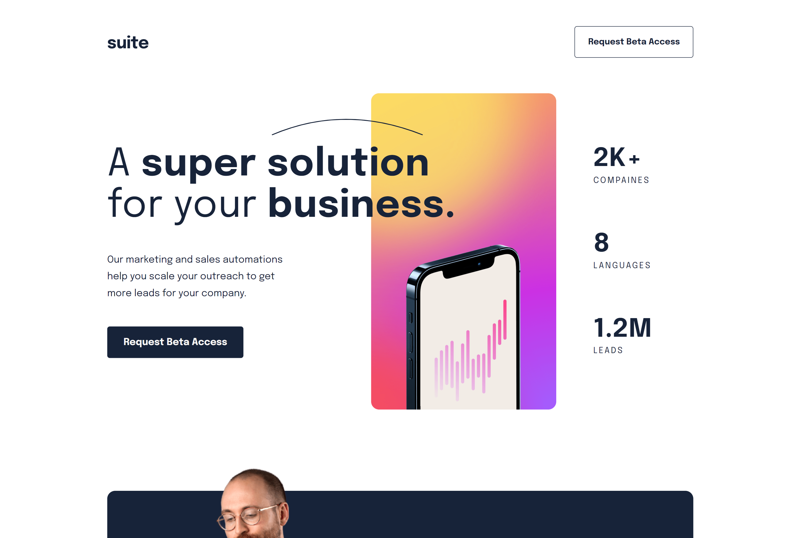

# Frontend Mentor -  suite landing page solution

This is a solution to the [Suite landing page challenge on Frontend Mentor](https://www.frontendmentor.io/challenges/suite-landing-page-tj_eaU-Ra). Frontend Mentor challenges help you improve your coding skills by building realistic projects. 

## Table of contents

- [Overview](#overview)
  - [Screenshot](#screenshot)
  - [Links](#links)
- [My process](#my-process)
  - [Built with](#built-with)
- [Getting started](#getting-started)
- [Author](#author)

## Overview

### Screenshot

## Desktop view

## Tablet view

## Mobile view

### Links

- Solution URL: [Source code](https://github.com/cwasi/suite-landing-page)
- Live Site URL: [Live site](https://cwasi-suite-landing-page.netlify.app/)

## My process

### Built with

- HTML5 
- SCSS

## Getting Started

- run `npm install` or `npm i` to install all dependencies
- run `npm start` to run the server

## Author 👦
- GitHub - [@cwasi](https://github.com/cwasi)
- Frontend Mentor - [@cwasi](https://www.frontendmentor.io/profile/cwasi)